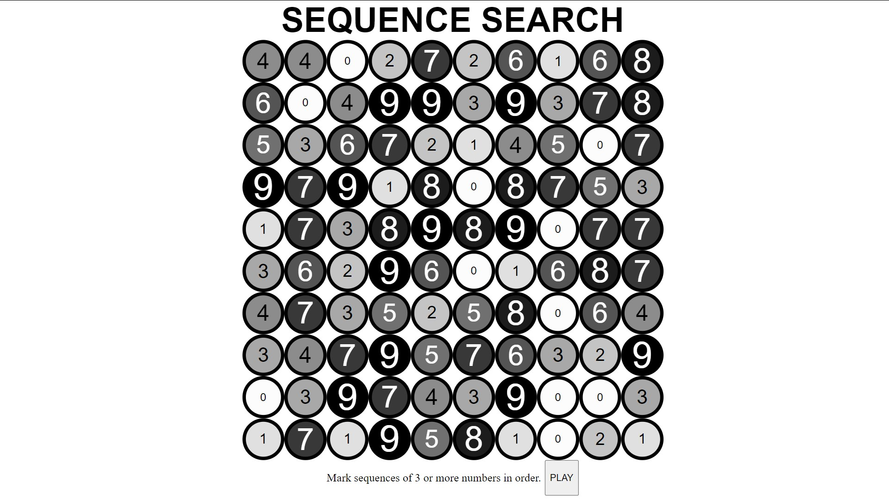

# Sequence Search Game

https://chairsitter.github.io/SequenceSearchGame/

## Description

This is a small game I made for practice and fun.

- I wanted to make a little number game using relatively efficient javascript code
- I used the random number values that populated the circles as input to change the text size and background color of each circle
- I thought it would be interesting to use these cues as a visual aid to the player in a simple search game to find sequences of 3 or more numbers in numerical order in a grid of random numbers.
- If this game is interesting enough I could add code to verify a player's score and also identify sequences they missed. A timer could also be added. 
- A scoring idea I have is that a sequence would be worth (length^2)* the highest number in the sequence. A run of 5678 would then be worth (4^2) * 8, for 128 points. For now you just toggle a circle as selected or not, and you can just try to get as many circles out of 100 as possible. 
- This game in its current state might be a bit headache-inducing so I would consider changing some of the display rules.

